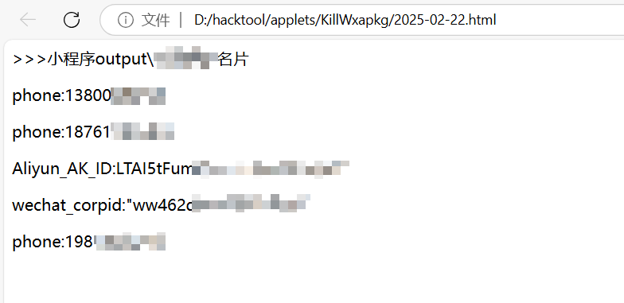

# KillWxapkg-Auto

> 二开KillWxapkg，自动化监控实时点击打开的微信小程序进行反编译，辅助小程序渗透测试。
> 原作者：https://github.com/Ackites/KillWxapkg


------------------
## 声明

**本程序仅供于学习交流，请使用者遵守《中华人民共和国网络安全法》，勿将此工具用于非授权的测试，开发者不负任何连带法律责任。**

**核心抄的，只是个自动化；没啥技术难度，大哥们别来提有关核心的issue，我只是个搬运工。**

## 二开

> 思路原本是24年上半年就想到，后面由于各种原因忘了。后面听了小迪直播中艾克sec的分享，同为22期学员差距怎么这么大。现在看来还是自己懒了。
> 想到了《士兵突击》团长对许三多说的话：
> “想到和得到的中间，还有两个字：做到！” 

1. 【完成】自动监控实时点击打开的微信小程序进行反编译，并输出反编译后的代码。

2. 【完成】将微信appid查询转换为微信小程序名字，方便后续查找泄露文件点复现漏洞。(需要联网)

3. 【废弃】~~优化原作者敏感信息查找规则以及方式。~~ 发现原作者规则更改很简单，config/rule.yaml 自定义即可。(把email、phone、wxid等设置false减少干扰，另外修改原版敏感信息匹配输出json为html)



4. 【计划】改成WEBUI界面，方便使用。(问为啥不改成客户端，就是说个人感觉打开界面太多了会太杂乱，不如一个浏览器一个窗口)

## 介绍
>主要新增KillWxapkg-Auto.exe -auto用法, 其余用法参照原作者。

config/config.yaml 配置小程序目录绝对路径

> KillWxapkg-Auto.exe -auto


**有时候会编译失败找不到文件，这里多是小程序太大网络环境较慢导致，可以等一会小程序对应文件加载完删掉Ctrl+Z重新进行反编译。**
```shell
$ KillWxapkg-Auto.exe --help

  -auto
        是否目录监控自动反编译，点击即是反编译
  -ext string
        处理的文件后缀 (default ".wxapkg")
  -hook
        是否开启动态调试
  -id string
        微信小程序的AppID
  -in string
        输入文件路径（多个文件用逗号分隔）或输入目录路径
  -noClean
        是否清理中间文件
  -out string
        输出目录路径（如果未指定，则默认保存到输入目录下以AppID命名的文件夹）
  -pretty
        是否美化输出
  -repack string
        重新打包wxapkg文件
  -restore
        是否还原工程目录结构
  -save
        是否保存解密后的文件
  -sensitive
        是否获取敏感数据
  -watch
        是否监听将要打包的文件夹，并自动打包
```
